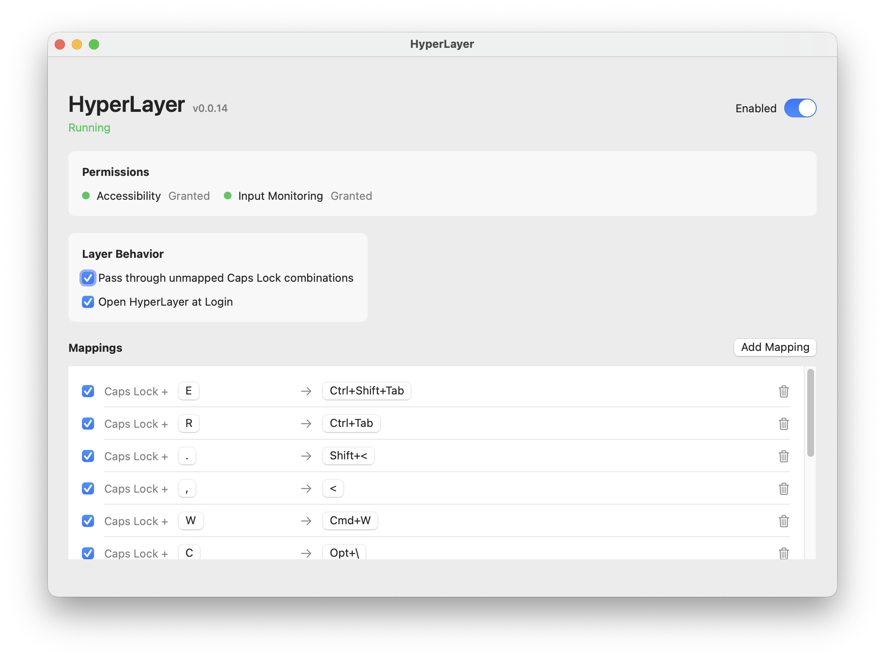

# HyperLayer

Caps Lock as a programmable keyboard layer for macOS.



HyperLayer suppresses the normal Caps Lock behavior and lets you map `Caps Lock + key` to any keyboard shortcut, including modifier combinations such as `Ctrl+Tab`, `Cmd+Shift+P`, or `Opt+Left Arrow`.

## Why

I created HyperLayer because I was unsatisfied with the complexity of setting up Karabiner and Kanata, and I did not want to use a commercial product that felt like overkill for my needs.

## Features

- Caps Lock layer key.
- Per-key output shortcuts.
- Recorder buttons for trigger keys and output shortcuts.
- Automatic permission checks.
- Saved configuration.
- Restores the original Caps Lock mapping when disabled or quit.

## Build

```sh
xcodegen generate
xcodebuild -project HyperLayer.xcodeproj -scheme HyperLayer -configuration Debug -derivedDataPath build build
```

## Run

```sh
open build/Build/Products/Debug/HyperLayer.app
```

## Permissions

HyperLayer needs Accessibility and Input Monitoring.

The app requests what it can and opens the relevant System Settings panes when macOS requires manual approval. It rechecks permissions automatically every 10 seconds.

## How It Works

When enabled, HyperLayer maps physical Caps Lock to F18 with `hidutil`, consumes that layer key through a keyboard event tap, and emits the configured output shortcut for matching combinations.
